# Tic Tac Toe

Developed using SwiftUI  
Sounds from Zapsplat.com

## Screenshots

  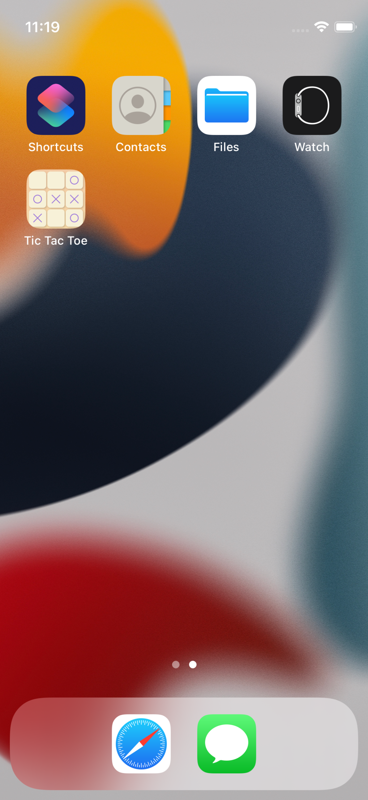
  &nbsp; &nbsp; &nbsp; &nbsp;
  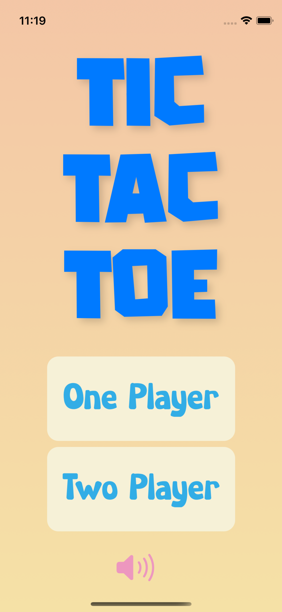

## One Player Mode

  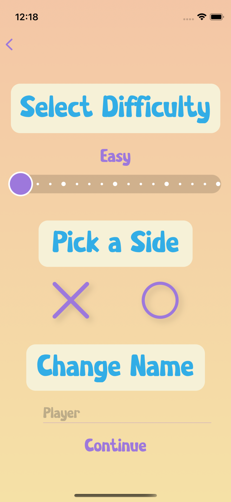
  &nbsp; &nbsp; &nbsp; &nbsp;
  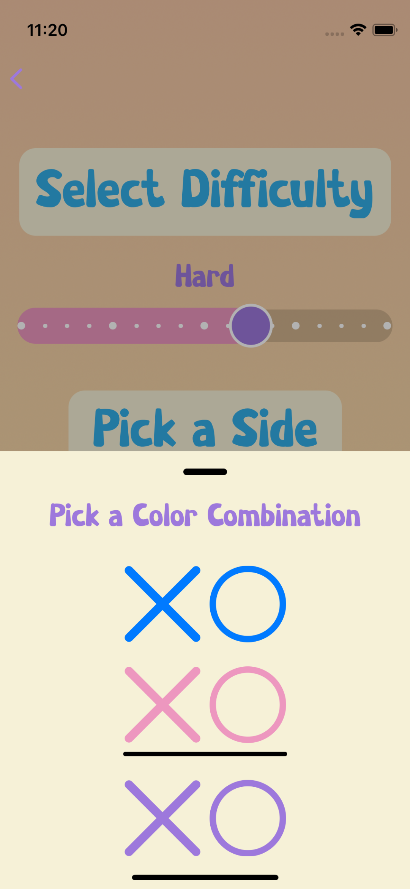
  &nbsp; &nbsp; &nbsp; &nbsp;
  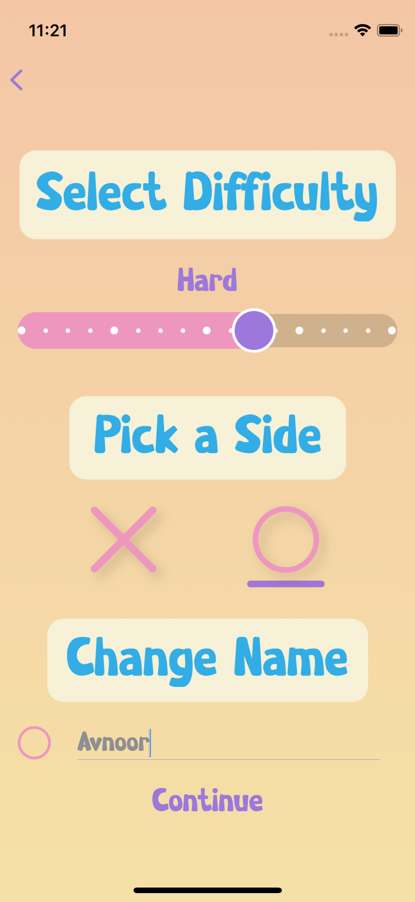

  
   &nbsp; &nbsp; &nbsp; &nbsp;
  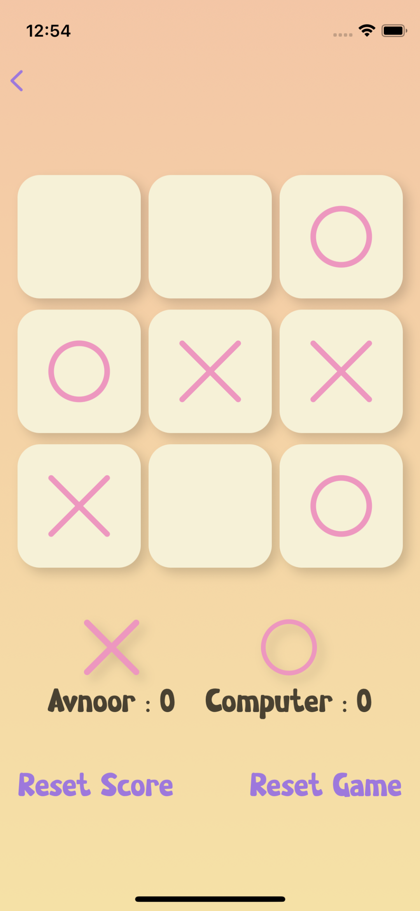
   &nbsp; &nbsp; &nbsp; &nbsp;
  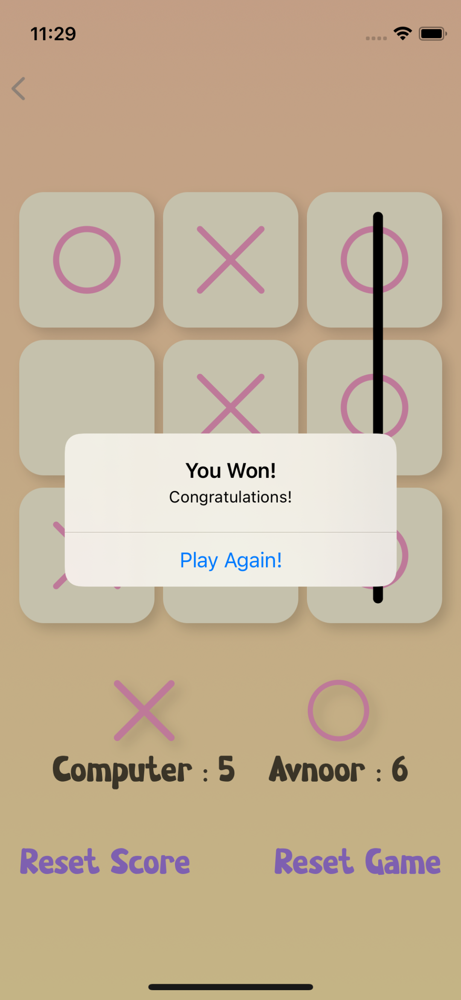

### Two Player Mode

  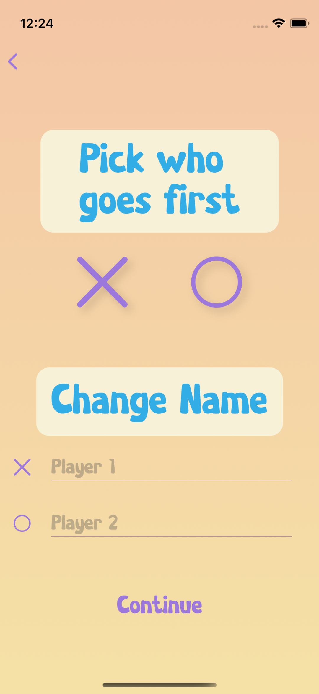
   &nbsp; &nbsp; &nbsp; &nbsp;
  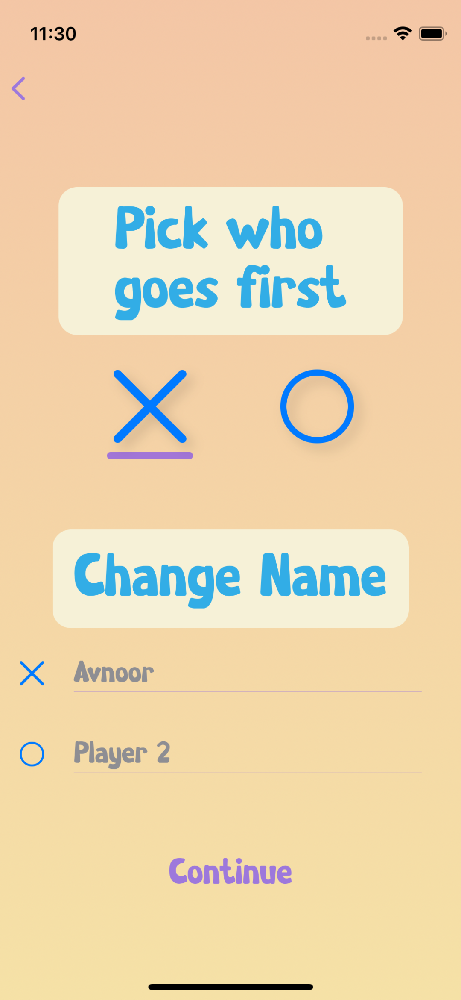
   &nbsp; &nbsp; &nbsp; &nbsp;
  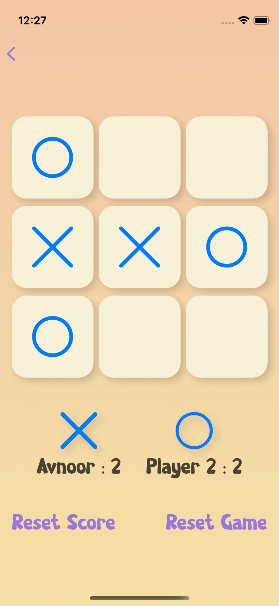
   &nbsp; &nbsp; &nbsp; &nbsp;
  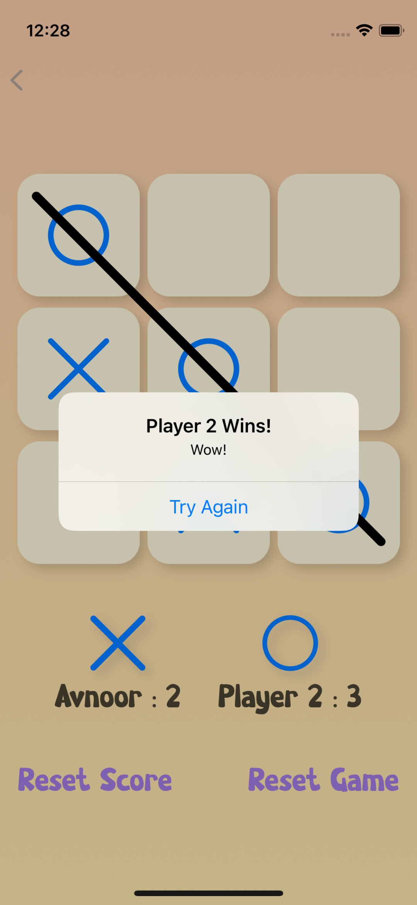

