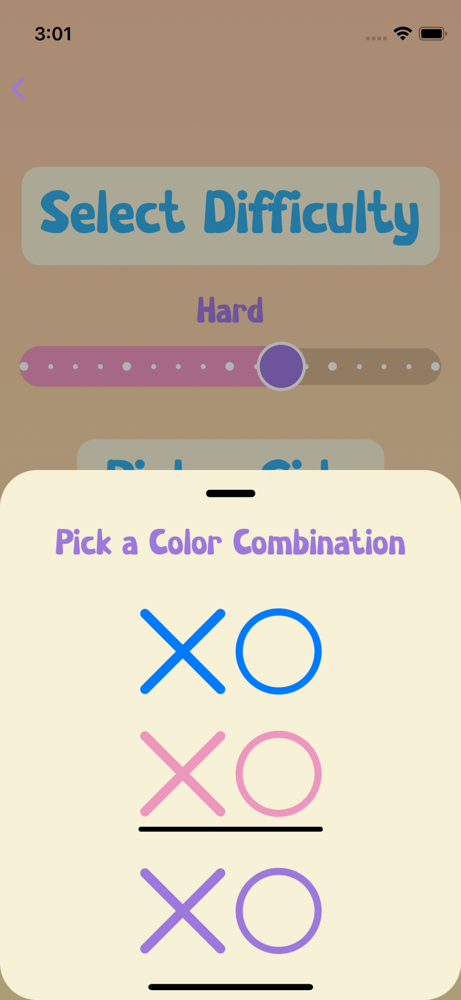
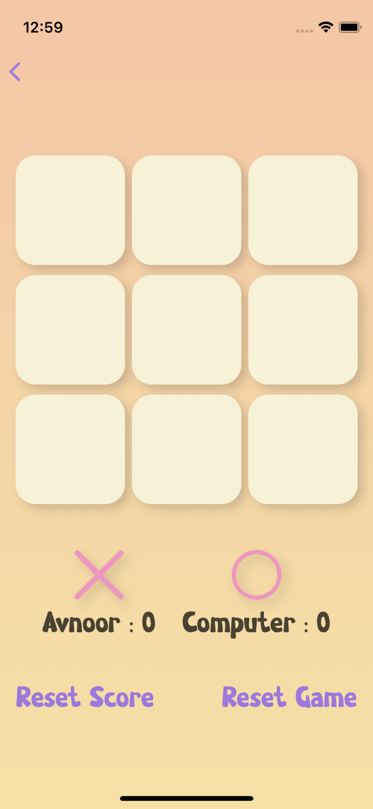

# Tic Tac Toe

Developed using SwiftUI  
Sounds from Zapsplat.com

## Demo
<video src='https://user-images.githubusercontent.com/85960421/187058056-0953ab6d-5def-43b3-8ae6-5d4441cffd14.mov' width=200></video>

## Screenshots

  
  &nbsp; &nbsp; &nbsp; &nbsp;
  

## One Player Mode

  
  &nbsp; &nbsp; &nbsp; &nbsp;
  
  &nbsp; &nbsp; &nbsp; &nbsp;
  

  
   &nbsp; &nbsp; &nbsp; &nbsp;
  
   &nbsp; &nbsp; &nbsp; &nbsp;
  

## Two Player Mode

  
   &nbsp; &nbsp; &nbsp; &nbsp;
  
   &nbsp; &nbsp; &nbsp; &nbsp;
  
   &nbsp; &nbsp; &nbsp; &nbsp;
  

